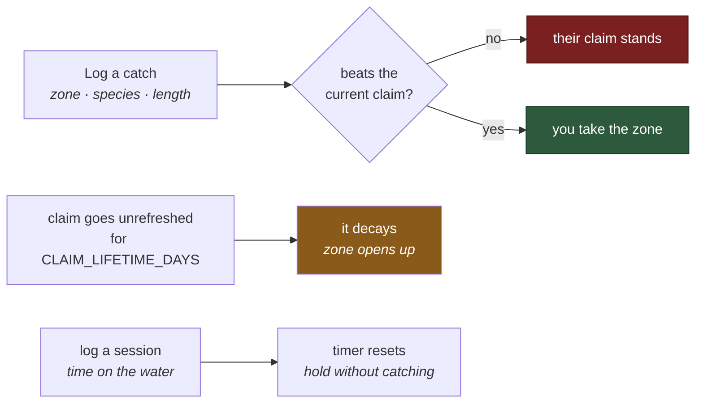
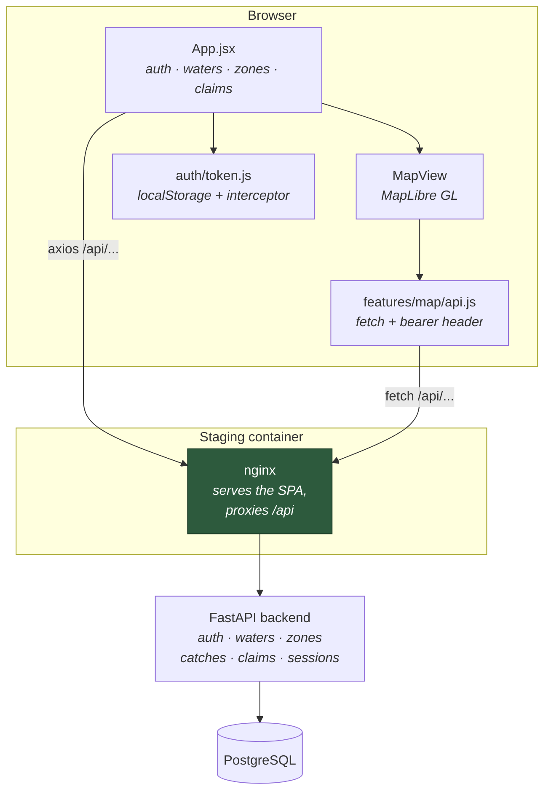

# FishClaim — UI

A territory game played on real rivers. Claim a stretch of water by catching the biggest fish in
it; hold it by keeping showing up. This repo is the **React frontend** — the API lives in
[`fishclaim-backend`](https://github.com/decstar714/fishclaim-backend).

**Stack:** React 19 · Vite (rolldown) · MapLibre GL · Axios

 

---

## Table of Contents

- [The rule](#the-rule)
- [How the pieces fit](#how-the-pieces-fit)
- [What the UI does](#what-the-ui-does)
- [The map](#the-map)
- [Local development](#local-development)
- [Environment](#environment)
- [Staging deployment](#staging-deployment)
- [Layout](#layout)
- [Branching](#branching)
- [Status](#status)

---

## The rule

Everything in the game comes from one rule: **per zone, per species, the longest fish holds the
claim.** Claims decay if the holder stops fishing them.



Claim resolution is decided server-side — see `evaluate_claim_for_catch` in the backend. The UI
never awards a claim itself; it renders what the API reports. Log a catch and the response says
nothing about whether you took the zone, so the app refetches the zone's claims immediately
afterwards to find out.

---

## How the pieces fit



The nginx proxy means the browser only ever talks to **one origin**, so the app can use a
relative `/api` base and CORS never enters the picture in staging. In local dev you point
`VITE_API_BASE_URL` straight at the backend instead, and the backend's `CORS_ORIGINS` has to
include your dev host.

**There are two HTTP clients in here, and they do not share auth.** `App.jsx` uses axios with a
global `Authorization` default and a response interceptor that refreshes on 401. `MapView` uses
bare `fetch` through `features/map/api.js`, which is handed the token as a prop and sets the
header itself. The interceptor cannot see those calls, so the map has its own retry path —
`onAuthError` in `App.jsx` — instead. Change the auth flow and both need touching.

---

## What the UI does

One screen: a fixed 360px control rail on the left, the map filling the rest.

| Panel | Condition | Does |
|---|---|---|
| Login | always | Form login, or logout when a session exists |
| Waters | always | Loads `/waters/` on mount, one button per water |
| Zones | a water is selected | Loads `/waters/{id}/zones` |
| Claims | a zone is selected | Active claims, with review controls for admins and reviewers |
| Log catch | a zone is selected | Species, length, method, notes → `POST /catches/` |
| Map | logged in | Rivers and claims for the current viewport |

Styling is inline `style` objects throughout, no UI framework and no CSS modules — a dark palette
(`#111827` shell, `#0b1220` rail) written directly into the components.

The species dropdown is **hardcoded to `1` Brown Trout and `2` Rainbow Trout**, which happen to be
the IDs the backend seed creates. It does not call `/api/species/`, so a third species is
invisible to the UI until this is wired up.

---

## The map

MapLibre GL, Carto Positron basemap, opening on the South Branch of the Raritan at
`[-74.742, 40.612]`, zoom 10.

Two GeoJSON sources are created empty on load — `rivers` drawn as blue lines with zoom-interpolated
width, `claims` as translucent fills with an outline. On `load` and on every `moveend` the current
viewport bbox is sent to the API, debounced 250ms so a drag fires one request rather than forty.
A HUD in the top-left shows the loaded feature counts, or the error if a fetch failed.

### Map data is still a placeholder

`/api/rivers` and `/api/claims` currently return **empty GeoJSON**. The backend stores positions
as plain `lat`/`lng` floats and zones as ordered records — there is no geometry layer, so there
are no polygons to draw. The endpoints exist so the map client gets a valid empty response
instead of a 404. Everything above works; it just renders zero features.

Wiring real zone geometry is the next meaningful piece of work, and the point at which PostGIS
starts earning its place in the stack.

---

## Local development

```bash
npm install
cp .env.example .env.local     # then edit it
npm run dev -- --host          # --host exposes it to your phone on the LAN
```

Available at `http://localhost:5173`, and at `http://<your-lan-ip>:5173` from a phone on the same
network.

| Script | Does |
|---|---|
| `npm run dev` | Vite dev server |
| `npm run build` | Production build into `dist/` |
| `npm run preview` | Serve the built output |
| `npm run lint` | ESLint 9 flat config |

Vite is pinned to `rolldown-vite` through a `package.json` override, so `vite` resolves to the
Rust-based build rather than the standard package. It is a drop-in, but a lockfile refresh that
loses the override will quietly change the bundler.

### Running the backend alongside

See the [backend README](https://github.com/decstar714/fishclaim-backend). In short:

```bash
cd ../fishclaim-backend
cp .env.example .env      # set SECRET_KEY -- generate your own
docker compose up -d --build
```

```bash
python -c "import secrets; print(secrets.token_urlsafe(48))"
```

API on `:8080`, Swagger at `/api/docs`. Read [Status](#status) before expecting a login to hold.

---

## Environment

`.env.local` is gitignored. `.env.example` is the template.

| Variable | Default | Purpose |
|---|---|---|
| `VITE_API_BASE_URL` | — | Backend API base, e.g. `http://<server-ip>:8080/api`. Leave as `/api` behind the nginx proxy |
| `VITE_RIVERS_BBOX_PATH` | `/rivers` | River geometry path, appended to the base |
| `VITE_CLAIMS_BBOX_PATH` | `/claims` | Claim geometry path, appended to the base |

> `VITE_*` values are **inlined into the bundle at build time**, not read at runtime. Anything
> put in one is readable by anyone who opens devtools — never a secret.

`App.jsx` reads `VITE_API_BASE_URL` with no fallback, so an unset value makes every request go to
`undefined/waters/`. `features/map/api.js` falls back to `""` instead. Set it.

---

## Staging deployment

`Dockerfile` builds the SPA with Node and serves the output with nginx — the runtime image
contains no Node and no `node_modules`.

```bash
docker build -t fishclaim-ui .
docker run -d -p 8081:80 \
  -e BACKEND_ORIGIN=http://fishclaim_backend:8000 \
  fishclaim-ui
```

`BACKEND_ORIGIN` is substituted into `nginx.conf` at container start, so the same image can be
pointed at a different backend without rebuilding. `VITE_API_BASE_URL` defaults to `/api` at
build time, which is what makes the proxy path work.

nginx also handles SPA routing (`try_files $uri /index.html`, so a refresh on a deep link does
not 404), caches hashed assets for a year, and gzips text responses.

---

## Layout

```
src/
├── main.jsx                 entry -- mounts App, pulls in maplibre-gl.css
├── App.jsx                  the whole UI: auth, waters, zones, claims, catch form
├── index.css                base page styles
├── auth/
│   └── token.js             localStorage tokens, axios header, 401 refresh interceptor
└── features/map/
    ├── MapView.jsx          MapLibre map, sources, layers, bbox refetch
    ├── api.js               bbox fetches for rivers and claims
    └── index.js             barrel
```

```
Dockerfile                   two-stage node build -> nginx:alpine
nginx.conf                   SPA fallback, /api proxy, asset caching
hooks/pre-commit             credential scanner (install it manually)
```

Install the commit hook once per checkout — cloning does not do it:

```bash
ln -sf ../../hooks/pre-commit .git/hooks/pre-commit
```

---

## Branching

| Branch | Role |
|---|---|
| `main` | Production-ready, protected |
| `dev` | Integration — features land here first |
| `feature/*` | One branch per task |

```bash
git checkout dev && git pull
git checkout -b feature/my-task
# ... commit ...
git push -u origin feature/my-task
# PR into dev; merge dev -> main once tested
```

---

## Status

**Working:** login and logout, waters and zones from the API, catch logging, claim listing,
MapLibre map with navigation and viewport refetch.

**Known problems, in the order they will bite:**

**Login succeeds and the app immediately logs you back out.** `App.jsx` calls `GET /auth/me`
straight after login, and the backend on `main` does not serve that route. The 404 lands in
`fetchMe`'s catch, which calls `handleLogout()` and shows "Session expired." The map never
renders, because it is gated on a token that has just been cleared.

Three routes this app calls do not exist on the backend's `main` branch:

| Called from | Route | Lives on |
|---|---|---|
| `fetchMe` | `GET /auth/me` | `feature/auth-session-hardening` |
| `token.js` `refreshSession` | `POST /auth/refresh` | `feature/auth-session-hardening` |
| `updateClaimStatus` | `POST /claims/{id}/status` | `feature/auth-session-hardening` |

That backend branch also adds the `role` field this app reads for `canReview`, and the `status`
and `review_notes` fields it renders on every claim. None of them exist on `main`, so the claim
list shows an empty status and the review buttons never appear. Either merge
`feature/auth-session-hardening` on the backend or strip these calls out here — the two repos
cannot both be right as they stand.

**Refresh-token rotation is dead code until then.** `/auth/login` returns only an access token,
so `parseTokenResponse` stores an empty refresh token, `hasRefreshToken` is false, and the
interceptor's refresh branch never runs. A session just ends.

**No session logging UI.** The backend serves `POST /api/sessions` — the mechanism for holding a
zone without catching anything, which is half the game — and nothing here calls it.

**Errors are `alert()` and `window.prompt()`.** Fine for an MVP, not fine on a phone at the
river, which is where this is meant to be used.

**No tests and no CI.** Nothing runs on push.

**Not done yet:** real zone geometry, claims overlay rendering, watershed layers, species loaded
from the API, session logging.
