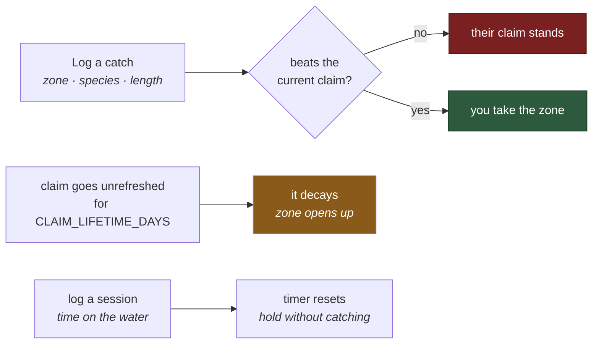
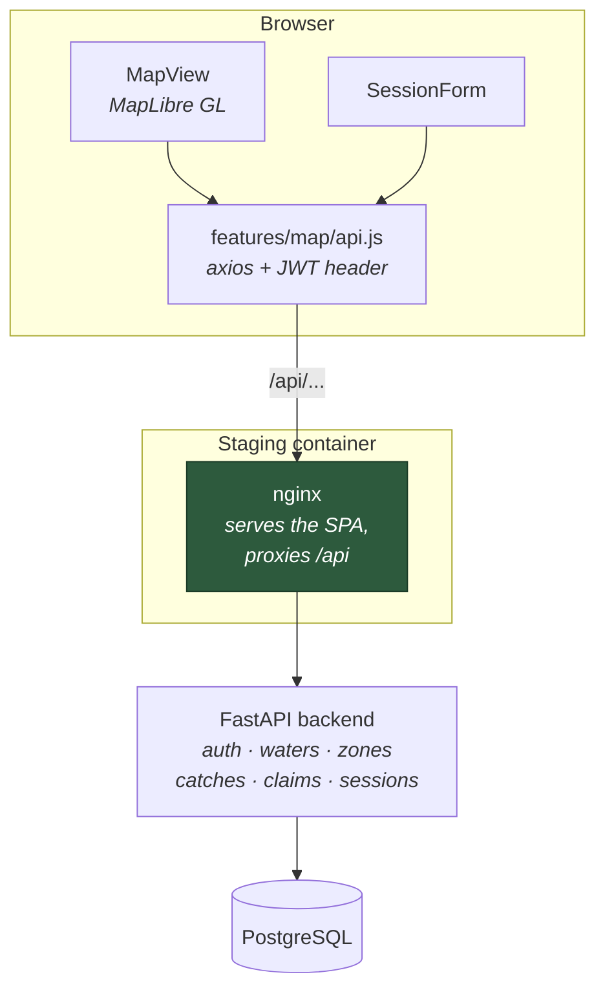

# FishClaim — UI

A map-based fishing territory game. Claim a stretch of river by catching the biggest fish
in it; hold it by keeping showing up. This repo is the **React frontend** — the API lives
in [`fishclaim-backend`](https://github.com/decstar714/fishclaim-backend).

**Stack:** React 19 · Vite (rolldown) · MapLibre GL · Axios

---

## The rule

Everything in the game comes from one rule: **per zone, per species, the longest fish
holds the claim.** Claims decay if the holder stops fishing them.



Claim resolution is decided server-side — see `evaluate_claim_for_catch` in the backend.
The UI never awards a claim itself; it renders what the API reports.

## How the pieces fit



The nginx proxy means the browser only ever talks to **one origin**, so the app can use a
relative `/api` base and CORS never enters the picture in staging. In local dev you point
`VITE_API_BASE_URL` straight at the backend instead, and the backend's `CORS_ORIGINS` has
to include your dev host.

### Map data is still a placeholder

`/api/rivers` and `/api/claims` currently return **empty GeoJSON**. The backend stores
positions as plain `lat`/`lng` floats and zones as ordered records — there is no geometry
layer yet, so there are no polygons to draw. The endpoints exist so the map client gets a
valid empty response instead of a 404.

Wiring real zone geometry is the next meaningful piece of work, and the point at which
PostGIS becomes a genuine dependency rather than an aspiration.

---

## Local development

```bash
npm install
cp .env.example .env.local     # then edit it
npm run dev -- --host          # --host exposes it to your phone on the LAN
```

Available at `http://localhost:5173`, and at `http://<your-lan-ip>:5173` from a phone on
the same network.

### Environment

`.env.local` is gitignored. `.env.example` is the template.

| Variable | Purpose |
|---|---|
| `VITE_API_BASE_URL` | Backend API base, e.g. `http://<server-ip>:8080/api`. Leave as `/api` when running behind the nginx proxy. |
| `VITE_RIVERS_BBOX_PATH` | River geometry path (default `/rivers`) |
| `VITE_CLAIMS_BBOX_PATH` | Claim geometry path (default `/claims`) |

> `VITE_*` values are **inlined into the bundle at build time**, not read at runtime.
> Anything put in one is readable by anyone who opens devtools — never a secret.

### Running the backend alongside

See the [backend README](https://github.com/decstar714/fishclaim-backend). In short:

```bash
cd ../fishclaim-backend
cp .env.example .env      # set SECRET_KEY — generate your own, see below
docker compose up -d --build
```

Generate a signing key rather than reusing one:

```bash
python -c "import secrets; print(secrets.token_urlsafe(48))"
```

API on `:8080`, Swagger at `/api/docs`.

---

## Staging deployment

`Dockerfile` builds the SPA with Node and serves the output with nginx — the runtime image
contains no Node and no `node_modules`.

```bash
docker build -t fishclaim-ui .
docker run -d -p 8081:80 \
  -e BACKEND_ORIGIN=http://fishclaim_backend:8000 \
  fishclaim-ui
```

`BACKEND_ORIGIN` is substituted into `nginx.conf` at container start, so the same image can
be pointed at a different backend without rebuilding.

---

## Layout

```
src/
├── main.jsx                 entry
├── App.jsx                  shell + auth flow
├── components/
│   └── SessionForm.jsx      log time on the water (refreshes a claim)
└── features/map/
    ├── MapView.jsx          MapLibre map, layers, claim interaction
    ├── api.js               axios wrapper, attaches the JWT
    └── index.js             barrel
```

---

## Branching

| Branch | Role |
|---|---|
| `main` | production-ready, protected |
| `dev` | integration — features land here first |
| `feature/*` | one branch per task |

```bash
git checkout dev && git pull
git checkout -b feature/my-task
# ... commit ...
git push -u origin feature/my-task
# PR into dev; merge dev -> main once tested
```

---

## Status

**Working:** JWT auth (register + login), waters and zones from the API, catch logging,
session logging, claim placement and takeover, claim decay, MapLibre map with navigation.

**Not done yet:** real zone geometry (rivers/claims return empty GeoJSON), claims overlay
rendering, watershed layers.
