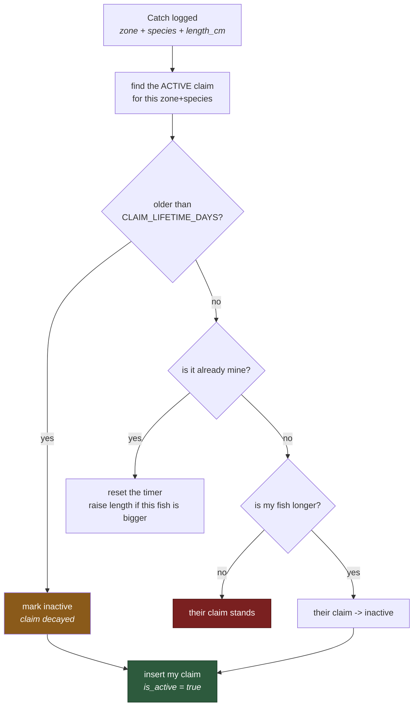
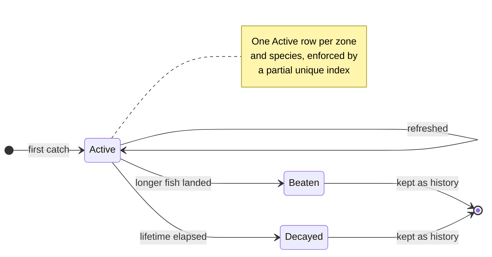
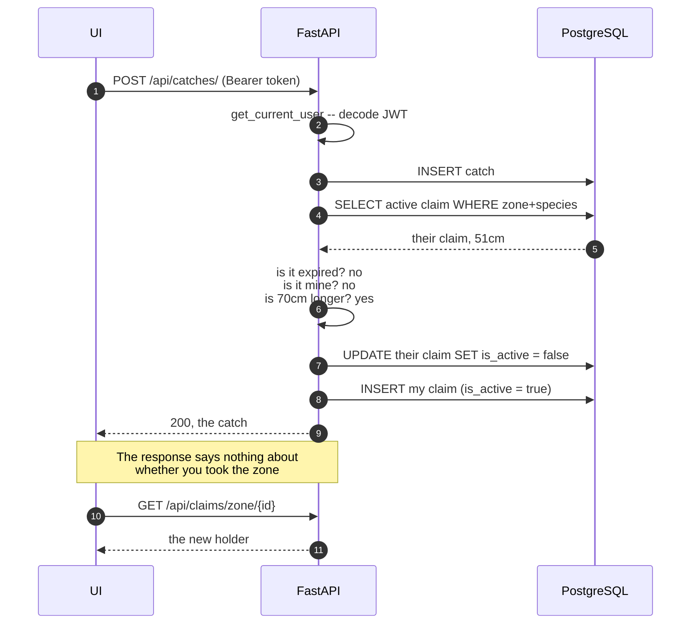
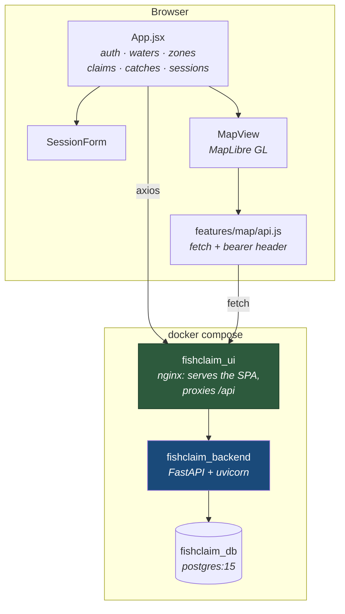
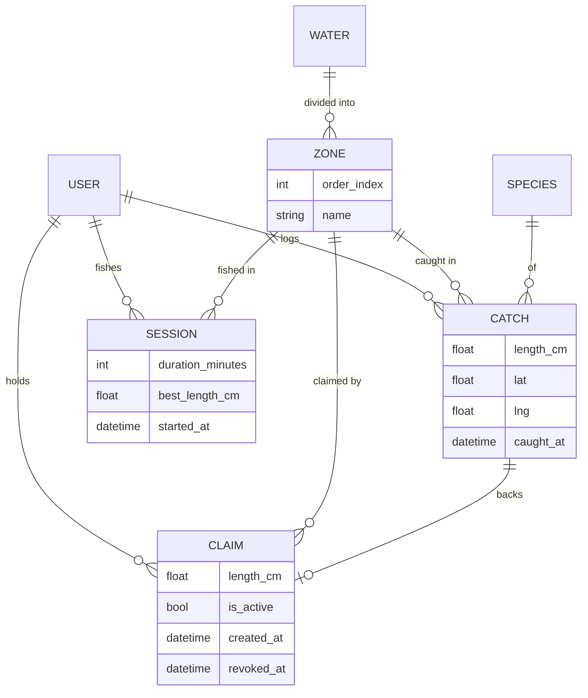
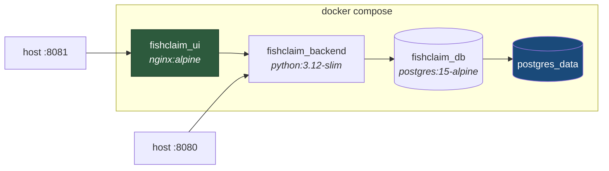

# FishClaim

A territory game played on real rivers. The biggest fish caught in a stretch of water holds that
stretch, until somebody catches a bigger one — or the holder stops showing up and the claim
decays.

**Stack:** React 19 · Vite (rolldown) · MapLibre GL — FastAPI · SQLAlchemy 2.0 · PostgreSQL 15 · Docker Compose


---

## Table of Contents

- [The rule](#the-rule)
- [The claim lifecycle](#the-claim-lifecycle)
- [Taking a zone, step by step](#taking-a-zone-step-by-step)
- [Architecture](#architecture)
- [Data model](#data-model)
- [API reference](#api-reference)
- [The screen](#the-screen)
- [The map](#the-map)
- [Quick start](#quick-start)
- [Configuration](#configuration)
- [Seeding the database](#seeding-the-database)
- [Deployment](#deployment)
- [Testing the contract](#testing-the-contract)
- [Project structure](#project-structure)
- [Branching](#branching)
- [Roadmap](#roadmap)

---

## The rule

The whole game is one rule: **per zone, per species, the longest fish holds the claim.**



That lives in `evaluate_claim_for_catch` in `backend/app/routes/claims.py`, and it is the only
place a claim is ever awarded. The UI never decides a claim; it renders what the API reports.
Three consequences are worth internalising before changing anything.

**Claims decay.** A claim expires `CLAIM_LIFETIME_DAYS` after it was last refreshed. The holder
refreshes it by catching again, or by logging time on the water without catching anything. You
have to keep showing up to hold water, which is the point of the game.

**Beaten claims are kept, not deleted.** They stay as rows with `is_active=false`, so a zone has
a history rather than only a current holder. That history is why the uniqueness rule is a
**partial** unique index on `(zone_id, species_id) WHERE is_active` — a plain unique constraint
including `is_active` would also cap you at one *inactive* row per zone, and the third time a
claim changed hands in any zone the insert would die with an `IntegrityError`. That is the core
loop of the game, so it broke everywhere at once. The reasoning is written down in
`backend/app/models.py`.

**Expiry is lazy, not scheduled.** Nothing sweeps the table. A claim is only noticed to be dead
when someone reads that zone or logs a catch in it — `_expire_if_needed` flips the row then.
There is no cron and no background task, so a zone nobody visits keeps a stale `is_active=true`
row until the next request touches it. Query the table directly and you will see rows the API
would consider expired.

---

## The claim lifecycle

Two states in the database, three ways to leave the live one.



**Beaten** and **Decayed** are the same column value, `is_active=false`. The difference is only
visible in `revoked_at` and in what the next catch does. Both stay in the table forever, which is
what makes a zone's history readable.

---

## Taking a zone, step by step

What actually happens when you log a fish that beats somebody:



**Logging a catch does not tell you whether you won it.** `POST /api/catches/` returns the catch,
not the claim, so the UI re-reads the zone straight afterwards to find out what changed.

---

## Architecture



The nginx proxy means the browser only ever talks to **one origin**, so the SPA uses a relative
`/api` base and CORS never enters the picture in the deployed stack. In local dev you point
`VITE_API_BASE_URL` straight at the API instead, and `CORS_ORIGINS` has to include your dev host.

**There are two HTTP clients in the frontend, and they do not share auth.** `App.jsx` uses axios
with a global `Authorization` default. `MapView` uses bare `fetch` through
`features/map/api.js`, which is handed the token as a prop and sets the header itself. Change the
auth flow and both need touching.

On the API side there is no service layer and no background worker. A route handler talks to the
session directly, and the one piece of real domain logic — the rule — lives in `routes/claims.py`
where both `catches` and `claims` can reach it. That is fine at this size and is the first thing
to pull apart if it grows.

---

## Data model



| Table | Holds |
|---|---|
| `users` | Account, hashed password, display name |
| `waters` | A river or lake — name, type, region |
| `zones` | An ordered stretch of a water. Claims are per zone, not per water |
| `species` | Common + scientific name, category |
| `catches` | A fish: length, optional weight, `lat`/`lng`, method, notes, photo URL |
| `claims` | Who holds a zone+species, backed by the catch that earned it |
| `sessions` | Time on the water. Refreshes a claim without a catch |

A claim always points at the `catch` that earned it, so "who holds this pool, and with what fish"
is answerable without recomputing anything.

**`claims.created_at` is not creation time.** Refreshing a claim overwrites it with `utcnow()`,
because expiry is computed as `created_at + CLAIM_LIFETIME_DAYS`. It means *last refreshed*. The
column is misnamed and worth renaming the next time the schema moves.

There is no geometry layer — no PostGIS, no GeoAlchemy2, no `ST_` calls. Positions are plain
`lat`/`lng` floats on a catch, and zones are ordered records rather than polygons. Zone
boundaries and point-in-polygon claim resolution are the features that would make PostGIS worth
adding; until then it would be weight without a job.

---

## API reference

All routes are mounted under `/api`. Interactive docs at `/api/docs` once the server is up.

| Method | Path | Auth | Purpose |
|---|---|---|---|
| `GET` | `/api/health` | — | Liveness check |
| `POST` | `/api/auth/register` | — | Create an account |
| `POST` | `/api/auth/login` | — | Form-encoded login, returns a bearer token |
| `GET` | `/api/waters/` | — | List waters |
| `GET` | `/api/waters/{water_id}/zones` | — | Zones of a water, in `order_index` order |
| `GET` | `/api/species/` | — | List species |
| `POST` | `/api/catches/` | **yes** | Log a catch. Runs claim evaluation |
| `GET` | `/api/claims/zone/{zone_id}` | — | Active claims in a zone, with `expires_at` |
| `POST` | `/api/sessions/` | **yes** | Log time on the water. Can refresh a claim |
| `GET` | `/api/sessions/` | **yes** | Your own sessions |
| `GET` | `/api/rivers` | — | Placeholder — returns empty GeoJSON |
| `GET` | `/api/claims` | — | Placeholder — returns empty GeoJSON |

Auth is a bearer JWT from `/api/auth/login`, signed HS256, validated in `backend/app/deps.py`.

**Login is form-encoded, not JSON.** It uses FastAPI's `OAuth2PasswordRequestForm`, so a JSON
body returns 422:

```bash
curl -X POST http://localhost:8080/api/auth/login \
  -d 'username=angler&password=...'
```

`/api/rivers` and `/api/claims` accept `minX`/`minY`/`maxX`/`maxY` and ignore them. They exist so
the map client gets a valid empty response instead of a 404 while there is no geometry to serve.

---

## The screen

One view: a fixed control rail on the left, the map filling the rest.

```
┌──────────────┬────────────────────────────────────────────┐
│  360px rail  │                                            │
│              │                                            │
│  Login /     │                                            │
│  Register    │            MapLibre GL canvas              │
│  ──────────  │                                            │
│  Waters      │      ┌────────────────┐                    │
│  ──────────  │      │ FishClaim      │  ← HUD: feature    │
│  Zones       │      │ Rivers: 0      │    counts, errors  │
│  ──────────  │      │ Claims: 0      │                    │
│  Claims      │      └────────────────┘                    │
│  ──────────  │                                            │
│  Log catch   │                                            │
│  ──────────  │                              ┌──────────┐  │
│  Log session │                              │ nav ctrl │  │
│              │                              └──────────┘  │
└──────────────┴────────────────────────────────────────────┘
     #0b1220                      gated on a token
```

Each rail panel appears only once the one above it has a selection:

| Panel | Appears when | Does |
|---|---|---|
| Login / Register | always | Form login, registration, or logout when a session exists |
| Waters | always | Loads `/waters/` on mount, one button per water |
| Zones | a water is selected | Loads `/waters/{id}/zones` |
| Claims | a zone is selected | Active claims in that zone |
| Log catch | a zone is selected | Species, length, method, notes → `POST /catches/` |
| Log session | a zone is selected | Time on the water → `POST /sessions/`, refreshes a claim |

Styling is inline `style` objects throughout — no UI framework, no CSS modules — in a dark
palette (`#111827` shell, `#0b1220` rail) written directly into the components.

---

## The map

MapLibre GL, Carto Positron basemap, opening on the South Branch of the Raritan at
`[-74.742, 40.612]`, zoom 10.

Two GeoJSON sources are created empty on load — `rivers` drawn as blue lines with
zoom-interpolated width, `claims` as translucent fills with an outline. On `load` and on every
`moveend` the current viewport bbox is sent to the API, debounced 250ms so a drag fires one
request rather than forty. A HUD in the top-left shows the loaded feature counts, or the error if
a fetch failed.

**The map data is still a placeholder.** `/api/rivers` and `/api/claims` return empty GeoJSON,
because there is no geometry layer to serve from. Everything above works; it renders zero
features. Wiring real zone geometry is the next meaningful piece of work.

---

## Quick start

### The whole stack

```bash
cd deploy
cp .env.example .env          # fill it in -- POSTGRES_PASSWORD and SECRET_KEY have no defaults
docker compose up -d --build
```

| | |
|---|---|
| UI | `http://localhost:8081` |
| API | `http://localhost:8080/api` |
| Docs | `http://localhost:8080/api/docs` |

Then seed it, or there are no waters to fish:

```bash
docker exec -it fishclaim_backend python -m app.seed
```

### Backend on its own

```bash
cd backend
python -m venv .venv
source .venv/bin/activate     # Windows: ./.venv/Scripts/activate
pip install -r requirements.txt
cp .env.example .env          # fill it in
uvicorn app.main:app --reload --host 0.0.0.0 --port 8000
```

You still need a Postgres to point `DATABASE_URL` at — `cd deploy && docker compose up -d db`
is the quickest.

### Frontend on its own

```bash
cd frontend
npm install
cp .env.example .env.local     # point VITE_API_BASE_URL at the API
npm run dev -- --host          # --host exposes it to your phone on the LAN
```

Available at `http://localhost:5173`, and at `http://<your-lan-ip>:5173` from a phone on the same
network. Running this way the SPA and the API are on different origins, so `CORS_ORIGINS` on the
backend has to include the dev host.

| Script | Does |
|---|---|
| `npm run dev` | Vite dev server |
| `npm run build` | Production build into `dist/` |
| `npm run preview` | Serve the built output |
| `npm run lint` | ESLint 9 flat config |

Vite is pinned to `rolldown-vite` through a `package.json` override, so `vite` resolves to the
Rust-based build rather than the standard package. It is a drop-in, but a lockfile refresh that
loses the override will quietly change the bundler.

---

## Configuration

Three templates, none of which carry values. All `.env` files are gitignored.

| File | Used by |
|---|---|
| `deploy/.env` | The compose stack — database, API and UI together |
| `backend/.env` | The API when run on its own |
| `frontend/.env.local` | The Vite dev server |

### Backend

| Variable | Default | Purpose |
|---|---|---|
| `DATABASE_URL` | *required* | SQLAlchemy URL, e.g. `postgresql+psycopg2://…@db:5432/fishclaim` |
| `SECRET_KEY` | *required* | JWT signing key. Validated at startup |
| `ALGORITHM` | `HS256` | JWT algorithm |
| `ACCESS_TOKEN_EXPIRE_MINUTES` | `1440` | Token lifetime |
| `CLAIM_LIFETIME_DAYS` | `30` | How long a claim survives without a refresh |
| `CORS_ORIGINS` | localhost dev ports | Comma-separated list of allowed origins |
| `SEED_USER_*`, `SEED_FORCE_RESET` | — | Read by `app/seed.py` only |

Generate a signing key rather than inventing one. The app validates it at startup and will not
boot on a blank, short or obviously-placeholder value:

```bash
python -c "import secrets; print(secrets.token_urlsafe(48))"
```

Changing it invalidates every issued token, so everyone logs in again.

`Settings` sets `extra="ignore"` deliberately. Several keys in the templates are consumed by
compose and by the seed script rather than by the app, and without it their presence in `.env` is
a hard startup failure — the local-Python path died on six keys the template itself ships. Docker
never showed it, because compose passes them as environment variables and those take a different
code path.

### Frontend

| Variable | Default | Purpose |
|---|---|---|
| `VITE_API_BASE_URL` | — | API base. Leave as `/api` behind the bundled nginx |
| `VITE_RIVERS_BBOX_PATH` | `/rivers` | River geometry path, appended to the base |
| `VITE_CLAIMS_BBOX_PATH` | `/claims` | Claim geometry path, appended to the base |

> `VITE_*` values are **inlined into the bundle at build time**, not read at runtime. Anything put
> in one is readable by anyone who opens devtools — never a secret.

`App.jsx` reads `VITE_API_BASE_URL` with no fallback, so an unset value sends every request to
`undefined/waters/`. Set it.

### The commit hook

`hooks/pre-commit` blocks credential-shaped strings from being staged. Cloning does not install
it:

```bash
ln -sf ../../hooks/pre-commit .git/hooks/pre-commit
```

---

## Seeding the database

The seed creates the owner account, one water with two zones, and two species. It is idempotent:
existing rows are left alone, except the owner password when `SEED_FORCE_RESET=true`.

| | |
|---|---|
| Water | South Branch Raritan River (NJ) |
| Zones | Ken Lockwood Gorge · Califon to Cokesbury |
| Species | Brown Trout · Rainbow Trout |

```bash
cd backend && python -m app.seed
# or, against the stack:
docker exec -it fishclaim_backend python -m app.seed
```

`SEED_USER_PASSWORD` has no default and the seed exits without one.

---

## Deployment

```bash
cd deploy
./deploy.sh [branch]      # default: main
```

Fetches the branch, rebuilds the backend and frontend images, and restarts those two containers.
It deliberately does not touch the database container — rebuilding it would drop the volume and
take every claim with it.



| Container | Image | Port | Volume |
|---|---|---|---|
| `fishclaim_ui` | Node 20 build → `nginx:alpine` | `${FRONTEND_PORT:-8081}` → 80 | — |
| `fishclaim_backend` | `python:3.12-slim` + FastAPI | `${BACKEND_PORT:-8080}` → 8000 | — |
| `fishclaim_db` | `postgres:15-alpine` | loopback only | `postgres_data` |

The frontend image is a two-stage build — the runtime carries nginx and the built assets, no Node
and no `node_modules`. `BACKEND_ORIGIN` is substituted into `nginx.conf` at container start, so
one image can be pointed at a different API without rebuilding. nginx also handles SPA routing
(`try_files $uri /index.html`, so a refresh on a deep link does not 404), caches hashed assets for
a year, and gzips text responses.

The database port is bound to `127.0.0.1` and the API reaches it over the compose network, so it
is not exposed to the LAN.

**There are no migrations.** `Base.metadata.create_all` runs at import in `backend/app/main.py`,
which creates missing tables and does **not** alter existing ones. A column added to a model will
never appear in a database that already has that table — that is a manual `ALTER TABLE`, or a
dropped volume. Alembic is the fix whenever the schema starts moving in earnest.

This compose file is a development stack. Anything exposed beyond a trusted network needs a
reverse proxy and TLS in front of it.

---

## Testing the contract

The frontend and backend used to live in separate repositories, and they drifted: for months the
UI called `/auth/me`, `/auth/refresh` and `/claims/{id}/status` against an API that served none of
them. You could log in successfully and be thrown straight back out. Nothing caught it, because
nothing ever had both halves in front of it at once.

That is the reason for this repo. A change to a route and a change to its caller are now one pull
request, and CI checks them together:

```bash
python scripts/check_api_contract.py
```

It reads every `${API_BASE}/...` call site in `frontend/src`, compares them against FastAPI's own
OpenAPI schema, and fails on anything the API does not serve. No server, no database, no browser.

```
  ok   /auth/login
  ok   /auth/register
  ok   /catches
  ok   /claims/zone/{}
  ...
  8 distinct paths called, 11 served
  every route the UI calls exists
```

---

## Project structure

```
fishclaim/
├── backend/
│   ├── app/
│   │   ├── main.py              # FastAPI app, CORS, router wiring, create_all
│   │   ├── config.py            # Settings from env/.env, startup validation
│   │   ├── database.py          # Engine, SessionLocal, get_db dependency
│   │   ├── models.py            # SQLAlchemy tables + the partial unique index
│   │   ├── schemas.py           # Pydantic request/response models
│   │   ├── auth.py              # Password hashing, JWT minting
│   │   ├── deps.py              # get_current_user -- bearer token -> User
│   │   ├── seed.py              # Owner account, home water, zones, species
│   │   └── routes/
│   │       ├── health.py        # Liveness
│   │       ├── auth.py          # register, login
│   │       ├── waters.py        # Waters and their zones
│   │       ├── species.py       # Species list
│   │       ├── catches.py       # Log a catch -> triggers claim evaluation
│   │       ├── claims.py        # evaluate_claim_for_catch + zone claim reads
│   │       ├── sessions.py      # Time on the water, claim refresh
│   │       └── mapdata.py       # Placeholder GeoJSON endpoints
│   ├── Dockerfile
│   └── requirements.txt
│
├── frontend/
│   ├── src/
│   │   ├── main.jsx             # entry -- mounts App, pulls in maplibre-gl.css
│   │   ├── App.jsx              # the UI: auth, waters, zones, claims, forms
│   │   ├── components/
│   │   │   └── SessionForm.jsx  # log time on the water
│   │   └── features/map/
│   │       ├── MapView.jsx      # MapLibre map, sources, layers, bbox refetch
│   │       ├── api.js           # bbox fetches for rivers and claims
│   │       └── index.js         # barrel
│   ├── nginx.conf               # SPA fallback, /api proxy, asset caching
│   ├── Dockerfile               # two-stage node build -> nginx:alpine
│   └── vite.config.js
│
├── deploy/
│   ├── docker-compose.yml       # db + backend + frontend
│   ├── deploy.sh                # pull, rebuild, restart -- leaves the db alone
│   └── .env.example
│
├── scripts/
│   └── check_api_contract.py    # the UI and the API must agree
│
└── hooks/pre-commit             # credential scanner (install it manually)
```

---

## Branching

| Branch | Role |
|---|---|
| `main` | Production-ready, protected |
| `dev` | Integration — features land here first |
| `feature/*` | One branch per task |

```bash
git checkout dev && git pull
git checkout -b feature/my-task
# ... commit ...
git push -u origin feature/my-task
# PR into dev; merge dev -> main once tested
```

---

## Roadmap

**Working:** registration and login, waters and zones, species, catch logging, session logging,
the full claim lifecycle — take, refresh, decay and history — and the MapLibre map with
navigation and viewport refetch.

**Next, roughly in order:**

| | Why it is next |
|---|---|
| Zone geometry | Zones are ordered records, not shapes. The map is wired end to end and renders zero features because there is nothing to draw. This is the one that makes the app look like the thing it is |
| Alembic migrations | `create_all` cannot alter an existing table, so the schema cannot move without manual SQL |
| A test suite | There are none yet. The contract check is a floor, not a substitute |
| Refresh tokens | Login returns an access token only, so a session ends rather than renewing |
| Leaderboards | The data is all there — claims carry holder, length and zone — nothing reads it that way yet |
