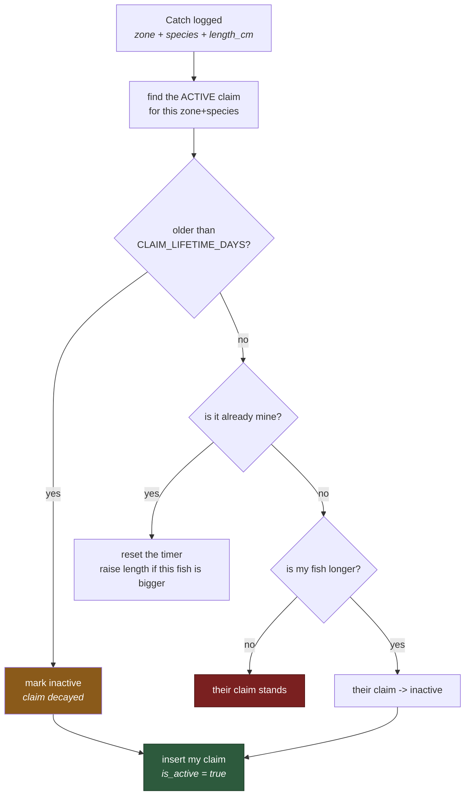
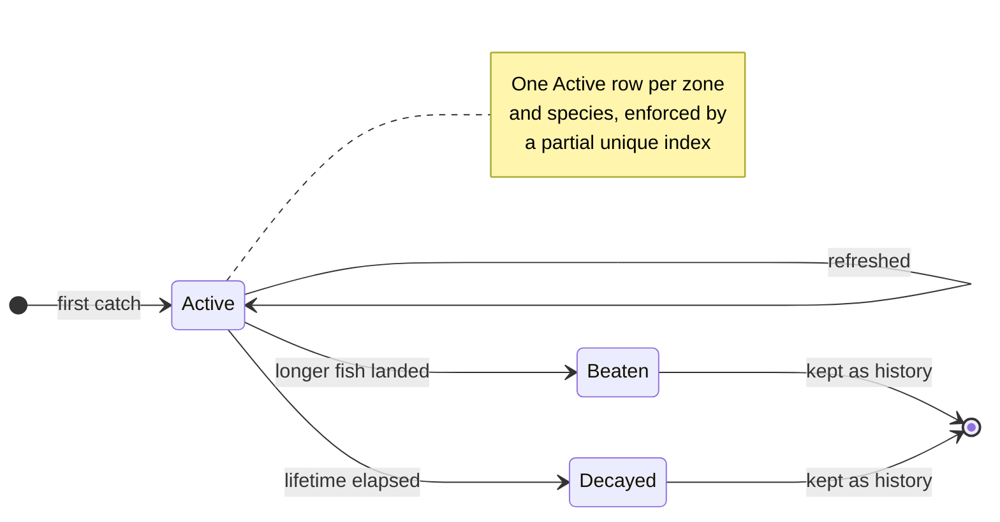
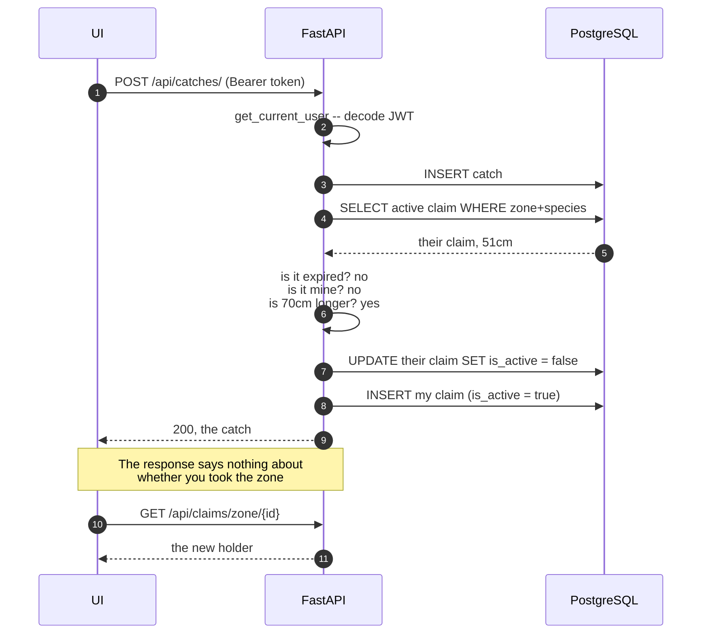
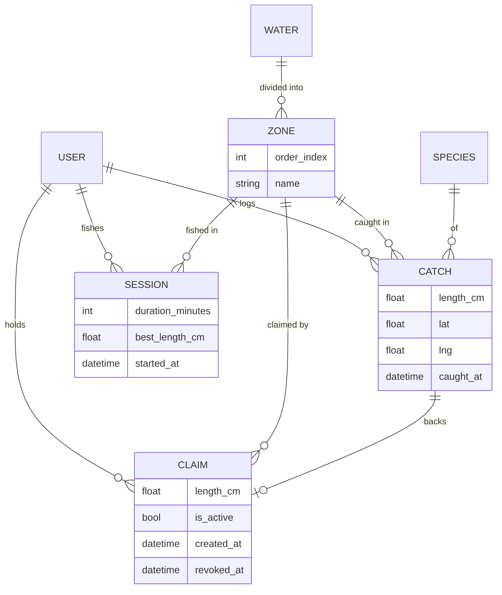
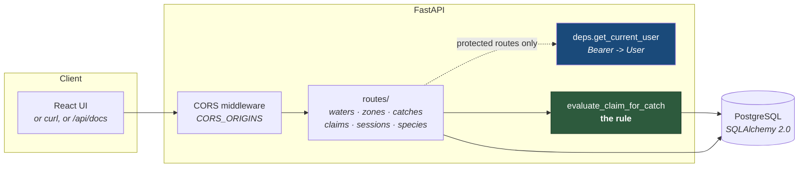
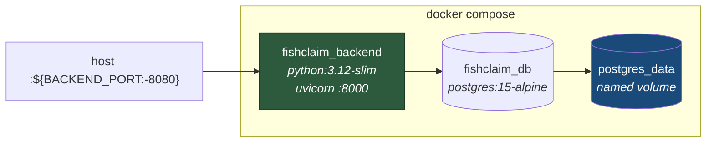

# FishClaim — API

A territory game played on real rivers. The biggest fish caught in a stretch of water holds that
stretch, until somebody catches a bigger one or the holder stops showing up and the claim decays.
This repo is the **FastAPI service** — the UI lives in
[`fishclaim`](https://github.com/decstar714/fishclaim).

**Stack:** FastAPI · SQLAlchemy 2.0 · PostgreSQL 15 · Docker Compose


---

## Table of Contents

- [The rule](#the-rule)
- [The claim lifecycle](#the-claim-lifecycle)
- [Taking a zone, step by step](#taking-a-zone-step-by-step)
- [Data model](#data-model)
- [How a request moves through the app](#how-a-request-moves-through-the-app)
- [API reference](#api-reference)
- [Quick start](#quick-start)
- [Configuration](#configuration)
- [Seeding the database](#seeding-the-database)
- [Deployment](#deployment)
- [Project structure](#project-structure)
- [Branching](#branching)
- [Roadmap](#roadmap)

---

## The rule

The whole game is one rule: **per zone, per species, the longest fish holds the claim.**



That lives in `evaluate_claim_for_catch` in `app/routes/claims.py`, and it is the only place a
claim is ever awarded. Three consequences are worth internalising before changing anything.

**Claims decay.** A claim expires `CLAIM_LIFETIME_DAYS` after it was last refreshed. The holder
refreshes it by catching again, or by logging time on the water (`POST /api/sessions`) without
catching anything. You have to keep showing up to hold water, which is the point of the game.

**Beaten claims are kept, not deleted.** They stay as rows with `is_active=false`, so a zone has
a history rather than only a current holder. That history is why the uniqueness rule is a
**partial** unique index on `(zone_id, species_id) WHERE is_active` — a plain unique constraint
including `is_active` would also cap you at one *inactive* row per zone, and the third time a
claim changed hands in any zone the insert would die with an `IntegrityError`. That is the core
loop of the game, so it broke everywhere at once. The reasoning is written down in
`app/models.py`.

**Expiry is lazy, not scheduled.** Nothing sweeps the table. A claim is only noticed to be dead
when someone reads that zone or logs a catch in it — `_expire_if_needed` flips the row then.
There is no cron and no background task, so a zone nobody visits keeps a stale `is_active=true`
row until the next request touches it. Query the table directly and you will see rows the API
would consider expired.

---

## The claim lifecycle

A claim has exactly two states in the database and three ways to leave the live one.



**Beaten** and **Decayed** are the same column value, `is_active=false`. The difference is only
visible in `revoked_at` and in what the next catch does. Both stay in the table forever, which is
what makes a zone's history readable.

---

## Taking a zone, step by step

What actually happens when you log a fish that beats somebody:



**Logging a catch does not tell you whether you won it.** `POST /api/catches/` returns the catch,
not the claim. The client has to re-read the zone to find out what changed. That is worth knowing
before wiring any UI to it.

---

## Data model



| Table | Holds |
|---|---|
| `users` | Account, hashed password, display name |
| `waters` | A river or lake — name, type, region |
| `zones` | An ordered stretch of a water. Claims are per zone, not per water |
| `species` | Common + scientific name, category |
| `catches` | A fish: length, optional weight, `lat`/`lng`, method, notes, photo URL |
| `claims` | Who holds a zone+species, backed by the catch that earned it |
| `sessions` | Time on the water. Refreshes a claim without a catch |

A claim always points at the `catch` that earned it, so "who holds this pool, and with what fish"
is answerable without recomputing anything.

**`claims.created_at` is not creation time.** Refreshing a claim overwrites it with `utcnow()`,
because expiry is computed as `created_at + CLAIM_LIFETIME_DAYS`. It means *last refreshed*. The
column is misnamed and worth renaming the next time the schema moves.

There is no geometry layer — no PostGIS, no GeoAlchemy2, no `ST_` calls. Positions are plain
`lat`/`lng` floats on a catch, and zones are ordered records rather than polygons. Zone
boundaries and point-in-polygon claim resolution are the features that would make PostGIS worth
adding; until then it would be weight without a job.

---

## How a request moves through the app



There is no service layer and no background worker. A route handler talks to the session directly,
and the one piece of real domain logic — the rule — lives in `routes/claims.py` where both
`catches` and `claims` can reach it. That is fine at this size and is the first thing to pull
apart if it grows.

---

## API reference

All routes are mounted under `/api`. Interactive docs at `/api/docs` once the server is up.

| Method | Path | Auth | Purpose |
|---|---|---|---|
| `GET` | `/api/health` | — | Liveness check |
| `POST` | `/api/auth/register` | — | Create an account |
| `POST` | `/api/auth/login` | — | Form-encoded login, returns a bearer token |
| `GET` | `/api/waters/` | — | List waters |
| `GET` | `/api/waters/{water_id}/zones` | — | Zones of a water, in `order_index` order |
| `GET` | `/api/species/` | — | List species |
| `POST` | `/api/catches/` | **yes** | Log a catch. Runs claim evaluation |
| `GET` | `/api/claims/zone/{zone_id}` | — | Active claims in a zone, with `expires_at` |
| `POST` | `/api/sessions/` | **yes** | Log time on the water. Can refresh a claim |
| `GET` | `/api/sessions/` | **yes** | Your own sessions |
| `GET` | `/api/rivers` | — | Placeholder — returns empty GeoJSON |
| `GET` | `/api/claims` | — | Placeholder — returns empty GeoJSON |

Auth is a bearer JWT from `/api/auth/login`, signed HS256, validated in `app/deps.py`.

**Login is form-encoded, not JSON.** It uses FastAPI's `OAuth2PasswordRequestForm`, so a JSON
body returns 422:

```bash
curl -X POST http://localhost:8080/api/auth/login \
  -d 'username=angler&password=...'
```

`/api/rivers` and `/api/claims` accept `minX`/`minY`/`maxX`/`maxY` and ignore them. They exist so
the map client gets a valid empty response instead of a 404 while there is no geometry to serve.

---

## Quick start

### Docker

```bash
cp .env.example .env          # fill it in -- see Configuration
docker compose up -d --build
```

API on `http://localhost:8080/api`, Postgres on `:5432`, docs at `/api/docs`.
Override the API port with `BACKEND_PORT`.

### Local Python

```bash
python -m venv .venv
source .venv/bin/activate     # Windows: ./.venv/Scripts/activate
pip install -r requirements.txt
cp .env.example .env          # fill it in
uvicorn app.main:app --reload --host 0.0.0.0 --port 8000
```

You still need a Postgres to point `DATABASE_URL` at. The quickest is the compose database on
its own:

```bash
docker compose up -d db
```

### Running the UI alongside

Clone [`fishclaim`](https://github.com/decstar714/fishclaim) next to this repo, make sure
`CORS_ORIGINS` here includes the Vite dev host (`http://localhost:5173` is the default), and
point the UI's `VITE_API_BASE_URL` at `http://localhost:8080/api`.

---

## Configuration

Everything is read from the environment, or from `.env` in the repo root. `.env` is gitignored;
`.env.example` is the template and carries no values.

| Variable | Default | Purpose |
|---|---|---|
| `DATABASE_URL` | *required* | SQLAlchemy URL, e.g. `postgresql+psycopg2://…@db:5432/fishclaim` |
| `SECRET_KEY` | *required* | JWT signing key. Validated at startup |
| `ALGORITHM` | `HS256` | JWT algorithm |
| `ACCESS_TOKEN_EXPIRE_MINUTES` | `1440` | Token lifetime |
| `CLAIM_LIFETIME_DAYS` | `30` | How long a claim survives without a refresh |
| `CORS_ORIGINS` | localhost dev ports | Comma-separated list of allowed origins |
| `BACKEND_PORT` | `8080` | Host port compose publishes. Read by compose, not by the app |
| `SEED_USER_*`, `SEED_FORCE_RESET` | — | Read by `app/seed.py` only |

Generate a signing key rather than inventing one. The app validates it at startup and will not
boot on a blank, short or obviously-placeholder value:

```bash
python -c "import secrets; print(secrets.token_urlsafe(48))"
```

Changing it invalidates every issued token, so everyone logs in again.

`Settings` sets `extra="ignore"` deliberately. The last two rows are consumed by compose and the
seed script rather than by the app, and without it their presence in `.env` is a hard startup
failure — the local-Python path died on six keys the template itself ships. Docker never showed
it, because compose passes them as environment variables and those take a different code path.

A pre-commit scanner in `hooks/` blocks credential-shaped strings from being staged. Cloning does
not install it:

```bash
ln -sf ../../hooks/pre-commit .git/hooks/pre-commit
```

---

## Seeding the database

The seed creates the owner account, one water with two zones, and two species. It is idempotent:
existing rows are left alone, except the owner password when `SEED_FORCE_RESET=true`.

| | |
|---|---|
| Water | South Branch Raritan River (NJ) |
| Zones | Ken Lockwood Gorge · Califon to Cokesbury |
| Species | Brown Trout · Rainbow Trout |

```bash
python -m app.seed
# or, in Docker:
docker exec -it fishclaim_backend python -m app.seed
```

`SEED_USER_PASSWORD` has no default and the seed exits without one.

---

## Deployment

```bash
./deploy.sh [branch]      # default: main
```

Fetches the branch, rebuilds the backend image and restarts the backend container. It does not
touch the database container, so data survives a deploy.



| Container | Image | Port | Volume |
|---|---|---|---|
| `fishclaim_backend` | `python:3.12-slim` + FastAPI | `${BACKEND_PORT:-8080}` → 8000 | — |
| `fishclaim_db` | `postgres:15-alpine` | 5432 | `postgres_data` |

**There are no migrations.** `Base.metadata.create_all` runs at import in `app/main.py`, which
creates missing tables and does **not** alter existing ones. A column added to a model will never
appear in a database that already has that table — that is a manual `ALTER TABLE`, or a dropped
volume. Alembic is the fix whenever the schema starts moving in earnest.

The compose file is a development stack. Anything exposed beyond a local machine needs its own
credentials, its own network policy and a reverse proxy in front.

---

## Project structure

```
fishclaim-backend/
├── app/
│   ├── main.py              # FastAPI app, CORS, router wiring, create_all
│   ├── config.py            # Settings from env/.env, startup validation
│   ├── database.py          # Engine, SessionLocal, get_db dependency
│   ├── models.py            # SQLAlchemy tables + the partial unique index
│   ├── schemas.py           # Pydantic request/response models
│   ├── auth.py              # Password hashing, JWT minting
│   ├── deps.py              # get_current_user -- bearer token -> User
│   ├── seed.py              # Owner account, home water, zones, species
│   └── routes/
│       ├── health.py        # Liveness
│       ├── auth.py          # register, login
│       ├── waters.py        # Waters and their zones
│       ├── species.py       # Species list
│       ├── catches.py       # Log a catch -> triggers claim evaluation
│       ├── claims.py        # evaluate_claim_for_catch + zone claim reads
│       ├── sessions.py      # Time on the water, claim refresh
│       └── mapdata.py       # Placeholder GeoJSON endpoints
│
├── hooks/pre-commit         # Credential scanner (install it manually)
├── Dockerfile               # python:3.12-slim, uvicorn on :8000
├── docker-compose.yml       # backend + postgres:15-alpine
└── deploy.sh                # Pull, rebuild, restart -- leaves the db alone
```

---

## Branching

| Branch | Role |
|---|---|
| `main` | Stable |
| `dev` | Integration |
| `feature/*` | One branch per task |

---

## Roadmap

**Working:** registration and login, waters and zones, species, catch logging, the full claim
lifecycle — take, refresh, decay and history — session logging, and the placeholder map
endpoints.

**Next, roughly in order:**

| | Why it is next |
|---|---|
| Zone geometry | Zones are ordered records, not shapes. Real boundaries are what make the map worth drawing, and the point at which PostGIS earns its place |
| Alembic migrations | `create_all` cannot alter an existing table, so the schema currently cannot move without manual SQL |
| A test suite | There are none on this branch |
| Refresh tokens | Login returns an access token only, so a session ends rather than renewing |
| Leaderboards | The data is all there — claims carry holder, length and zone — nothing reads it that way yet |
